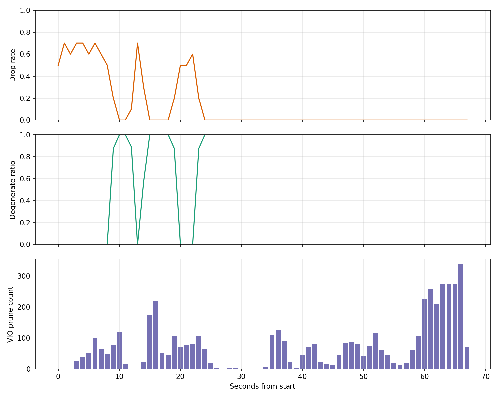

# FAST-LIVO2 with DE

> 面向工程落地的轻量化 FAST-LIVO 方案。核心目标是降低视觉更新开销、稳定视觉地图内存，并在 LiDAR 退化场景下维持鲁棒性。

本项目基于 ROS `fast_livo` 包组织，围绕“固定、可落地、便于验证”的思路，对原始视觉更新策略和视觉地图管理进行收敛式改造。README 的前半部分用于快速说明项目价值、依赖与运行方式，后半部分保留完整的详细设计，便于继续实现和复现实验。

## 效果图

<p align="center">
  
</p>

## 项目亮点

- 退化感知的视觉调度：LiDAR 几何退化时自动提高视觉更新频率，正常场景下按步长降频，直接降低视觉侧计算开销。
- 受控的视觉地图规模：通过体素内点数上限和超龄淘汰，避免视觉点长期累积导致的内存持续增长。
- 更轻量的图像处理链路：引入图像降采样和更小 patch 配置，减少每帧视觉处理成本。
- 局部地图与长期地图分离：局部地图服务实时估计，长期地图保留稀疏历史信息，便于滑窗管理。
- 工程实现导向：本方案不引入“可选路径”，所有机制默认启用，便于统一调参、实现和验证。

## 环境与依赖

- Ubuntu + ROS Noetic
- C++17
- catkin
- Eigen3
- PCL
- OpenCV
- `cv_bridge`
- `image_transport`

构建配置可参考 [`CMakeLists.txt`](./CMakeLists.txt)，ROS 包依赖可参考 [`package.xml`](./package.xml)。

## 快速开始

### 1. 构建

在 catkin 工作空间根目录执行：

```bash
catkin_make
source devel/setup.bash
```

### 2. 启动

以 Avia 配置为例：

```bash
roslaunch fast_livo mapping_avia.launch
```

对应启动文件位于：

- [`launch/mapping_avia.launch`](./launch/mapping_avia.launch)
- [`launch/mapping_mid360.launch`](./launch/mapping_mid360.launch)
- [`launch/mapping_ouster_ntu.launch`](./launch/mapping_ouster_ntu.launch)
- [`launch/mapping_hesaixt32_hilti22.launch`](./launch/mapping_hesaixt32_hilti22.launch)

### 3. 回放数据

```bash
rosbag play YOUR_DATA.bag
```

## 配置说明

- LiDAR / 系统主参数位于 [`config/`](./config) 下，例如 [`config/avia.yaml`](./config/avia.yaml)、[`config/mid360.yaml`](./config/mid360.yaml)。
- 相机参数位于 [`config/camera_pinhole.yaml`](./config/camera_pinhole.yaml) 及其他 `camera_*.yaml` 文件。
- 运行日志与结果脚本位于 [`Log/`](./Log)，例如 [`Log/analyze_runtime_log.py`](./Log/analyze_runtime_log.py) 与 [`Log/plot.py`](./Log/plot.py)。

## 方案目标

本方案将论文优化点与轻量化诉求融合为固定工程策略，重点关注以下三点：

- CPU 占用降低：视觉更新平均频率降到原来的 1/3。
- 内存稳定：视觉点数量上限 + 超龄淘汰，避免长时间运行时持续增长。
- 鲁棒性保留：LiDAR 退化时自动提高视觉更新频率，降低纯降频策略带来的估计风险。

## 详细设计

### A. `src/voxel_map.cpp` + `include/voxel_map.h`

**目标：输出统一的退化状态与指标，供视觉更新调度使用。**

1. 新增成员字段（`VoxelMapManager`）：
   - `double sigma_min_`
   - `double valid_plane_ratio_`
   - `double avg_residual_`
   - `int degen_count_`
   - `bool lidar_degenerate_`

2. 在 `VoxelMapManager::StateEstimation` 中计算指标：
   - `valid_plane_ratio_ = effct_feat_num_ / max(1, feats_down_size_)`
   - `avg_residual_ = total_residual / max(1, effct_feat_num_)`
   - `sigma_min_` 计算：
     - 构造 `N = Σ (n_i · n_i^T)`，`n_i` 为 `ptpl_list_` 中平面法向。
     - `sigma = SVD(N)`，`sigma_min_ = sigma(2) / sigma(0)`。

3. 固定退化判据（连续帧）：
   - `degenerate_now = (sigma_min_ < 0.07) || (valid_plane_ratio_ < 0.15) || (avg_residual_ > 0.12)`
   - `degen_count_ = degenerate_now ? degen_count_ + 1 : max(0, degen_count_ - 1)`
   - `lidar_degenerate_ = (degen_count_ >= 3)`

4. 提供只读接口：
   - `bool IsLidarDegenerate() const;`
   - `double GetSigmaMin() const;`

### B. `src/LIVMapper.cpp` + `include/LIVMapper.h`

**目标：严格控制视觉更新频率，并在退化时提频。**

1. 新增参数（读取 ROS 参数，默认值如下）：
   - `visual/image_stride_normal = 3`
   - `visual/image_stride_degenerate = 1`
   - `visual/keyframe_trans_thresh = 1.0`（米）
   - `visual/keyframe_rot_thresh = 30.0`（度）
   - `visual/keyframe_scale_min = 0.3`

2. 新增状态：
   - `int img_counter_`
   - `StatesGroup last_keyframe_state_`
   - `bool has_keyframe_state_`

3. 在 `img_cbk` 中执行帧选择（直接丢弃非选中帧）：
   - `img_counter_++`
   - 计算 `scale = clamp(3 * sigma_min_, keyframe_scale_min, 1.0)`
   - `trans_thresh = scale * keyframe_trans_thresh`
   - `rot_thresh = scale * keyframe_rot_thresh`
   - `is_keyframe = (Δpos > trans_thresh) || (Δrot > rot_thresh)`
   - `stride = IsLidarDegenerate() ? image_stride_degenerate : image_stride_normal`
   - `stride_hit = (img_counter_ % stride == 0)`
   - 使用规则固定为：`use_image = IsLidarDegenerate() || stride_hit || is_keyframe`
   - 若 `use_image == false`，直接 `return`，不进入 buffer。
   - 若 `is_keyframe == true`，更新 `last_keyframe_state_`。

4. 地图滑窗联动：
   - `mapSliding()` 完成后调用 `vio_manager->TrimVisualMap(center, radius)`。

### C. `src/vio.cpp` + `include/vio.h`

**目标：视觉点数量可控、图像处理更轻量。**

1. 新增参数（默认值）：
   - `visual/max_points_per_voxel = 30`
   - `visual/point_max_age = 50`（帧）
   - `visual/downsample_ratio = 0.5`
   - `visual/patch_pyrimid_level = 2`
   - `visual/patch_size = 6`

2. 视觉点上限与淘汰（`insertPointIntoVoxelMap`）：
   - 若 `voxel_points.size() >= max_points_per_voxel`：
     - 淘汰 `obs_.size()` 最小的点，并释放其 `Feature` 资源。

3. 超龄淘汰（`updateVisualMapPoints`）：
   - `current_id - pt->obs_.back()->id_ > point_max_age` 时删除点。

4. 图像降采样（`processFrame`）：
   - `cv::resize(img, img, Size(), downsample_ratio, downsample_ratio)`。
   - 同步更新相机内参与 `image_resize_factor`。

5. 新增 `TrimVisualMap(center, radius)`：
   - 将超出局部地图半径的视觉点转移到长期视觉地图。

6. 新增长期视觉地图：
   - `long_term_feat_map` 存储稀疏历史点。
   - `UpdateLongTermMapSliding` 按更大尺度滑动裁剪长期地图。

## 参数落地

以下参数建议写入 `config/*.yaml`：

```yaml
visual:
  image_stride_normal: 3
  image_stride_degenerate: 1
  keyframe_trans_thresh: 1.0
  keyframe_rot_thresh: 30.0
  keyframe_scale_min: 0.3
  max_points_per_voxel: 30
  long_term_max_points_per_voxel: 10
  point_max_age: 50
  downsample_ratio: 0.5
  patch_pyrimid_level: 2
  patch_size: 6

mapping:
  local_map_half_size: 60
  sliding_thresh: 20

long_term_map:
  map_sliding_en: true
  half_map_size: 400
  sliding_thresh: 40
```

## 实施顺序

1. `VoxelMapManager` 输出退化指标。
2. `LIVMapper` 按退化 / 关键帧 / 降频规则过滤图像。
3. `VIOManager` 加入视觉点上限与超龄淘汰。
4. 图像降采样 + patch 缩减。
5. 滑窗触发时裁剪视觉点。

## 验证建议

- 启动：

```bash
roslaunch fast_livo mapping_avia.launch
```

- 回放：

```bash
rosbag play YOUR_DATA.bag
```

- 建议重点检查：
  - 视觉更新频率是否明显下降。
  - LiDAR 退化场景下视觉更新是否恢复到高频。
  - 长时间运行后视觉点数量和内存占用是否稳定。
  - [`Log/`](./Log) 下的输出图像、点云和分析脚本结果是否符合预期。
